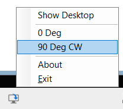

# QuickRotate

QuickRotate is a small utility that shows an icon in the taskbar notification area (system tray) of
Windows.

It was created for portable devices with a touch screen that have an unreliable
rotation / orientation sensor which can be quite annoying. To activate it, just touch
(left-click) the icon and the choose the rotation angle.

QuickRotate does not require any installation / setup (but it requires the .Net 6 Runtime) - just run the .exe

This project also provides the class library *RotateDisplayLib* which can be used in
PowerShell scripts or in your own .Net application.

**V1.1**

Double-click on the tray icon now rotates the screen, too.
(Unfortunately I haven't found out how to prevent the short flicker of the context menu, yet)

**Lib-Update 7/2023**

No changes in QuickRotate, but *RotateDisplayLib* has been renamed to *ScreenSettingsLib* because new methods have been added:

- TurnScreensOff
- TurnScreensOn
- TurnScreensOnAlternative
- ShowDesktop
- UndoShowDesktop

Additionally, the lib's project-type has been changed from NetStandard20 to multi-targeting
